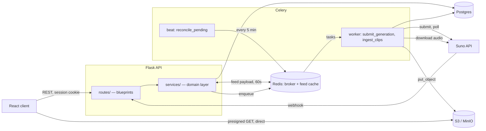

## Architecture

```mermaid
flowchart LR
    client["React client"]
    suno["Suno API"]

    subgraph api["Flask API"]
        routes["routes/ — blueprints"]
        services["services/ — domain layer"]
    end

    subgraph celery["Celery"]
        worker["worker: submit_generation, ingest_clips"]
        beat["beat: reconcile_pending"]
    end

    redis[("Redis: broker + feed cache")]
    pg[("Postgres")]
    s3[("S3 / MinIO")]

    client -->|"REST, session cookie"| routes
    routes --> services
    services --> pg
    services <-->|"feed payload, 60s"| redis
    services -->|"enqueue"| redis
    beat -->|"every 5 min"| redis
    redis -->|"tasks"| worker
    worker -->|"submit, poll"| suno
    suno -->|"webhook"| routes
    worker -->|"download audio"| suno
    worker -->|"put_object"| s3
    worker --> pg
    client -->|"presigned GET, direct"| s3
```